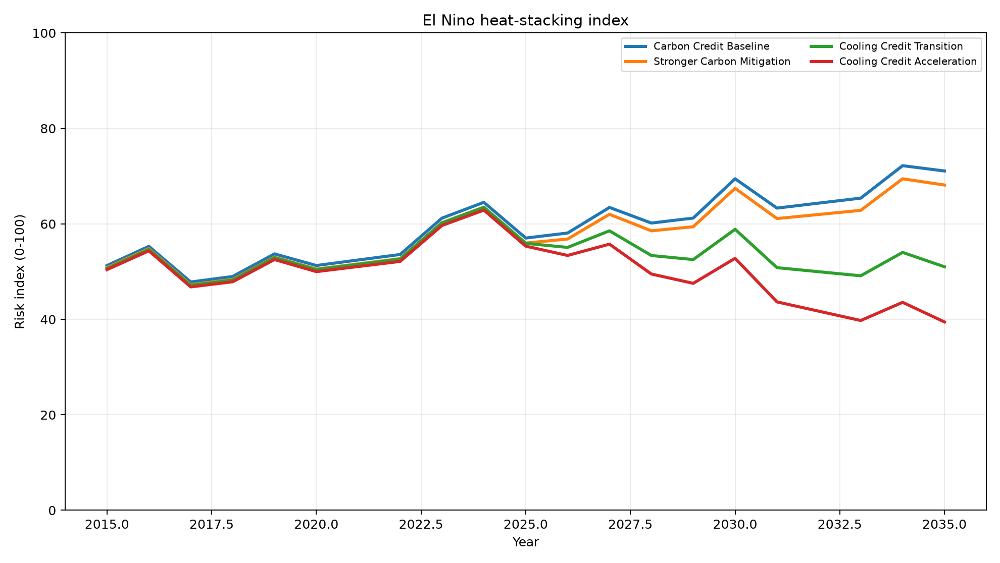

# 温暖化時代のエルニーニョは、地球からの警告である──海に蓄積した熱をどう冷やすのか

[English](./README.md) | 日本語 | [العربية](./README_ar.md)

> エルニーニョは自然現象である。
> しかし、温暖化時代のエルニーニョは、過去のエルニーニョと同じではない。
> すでに熱を抱えた海に、さらに熱が重なるからである。

---

## 結論：次のエルニーニョは、昔のエルニーニョとは違う

エルニーニョは自然現象です。

しかし、温暖化時代のエルニーニョは、過去のエルニーニョと同じではありません。

なぜなら、いまの地球はすでに温まりすぎているからです。

地球温暖化によって増えた余分な熱の大部分は、大気ではなく海に蓄積されています。
海は、地球の熱を受け止め続けてきました。

その上に、エルニーニョによる海面水温の上昇が重なります。

これは、単に「今年は少し暑い」という話ではありません。
すでに熱を抱えた海に、さらに熱が重なるということです。

10年以上前のエルニーニョと、現在のエルニーニョでは、前提条件が違います。
海面温度も、気温も、すでに一段高いところから始まっています。

だから、同じエルニーニョでも、起きる被害の規模は同じではありません。

- 熱波
- 海洋熱波
- 干ばつ
- 豪雨
- 森林火災
- サンゴの白化
- プランクトンの減少
- 魚の移動
- 農業被害
- 水不足
- 感染症リスク
- 生態系の崩壊

これらは、別々の問題ではありません。

地球が熱を逃がせなくなっているサインです。

---

## エルニーニョとは何か

エルニーニョとは、太平洋の赤道付近で海面水温が平年より高くなる自然現象です。

エルニーニョが起きると、世界各地の気象パターンが変化します。

たとえば、地域によっては次のような影響が出ます。

- 高温
- 干ばつ
- 豪雨
- 洪水
- 台風・サイクロンへの影響
- 農作物への影響
- 海洋生態系への影響
- 漁業資源への影響
- 森林火災リスクの上昇

本来、エルニーニョは地球の自然な揺らぎです。

問題は、エルニーニョそのものではありません。

問題は、地球全体の基礎温度がすでに上がりすぎた状態で、そこにエルニーニョが重なることです。

---

## なぜ温暖化時代のエルニーニョは危険なのか

昔のエルニーニョは、まだ比較的低い基礎温度の上に起きていました。

しかし現在は違います。

地球温暖化によって、大気も海も陸もすでに温まっています。
特に海は、地球にたまった余分な熱の大部分を吸収してきました。

人類は、気温の数字ばかりを見がちです。

しかし、本当に重要なのは、海の中に蓄積された熱です。

海は巨大な熱の貯蔵庫です。
表面だけが少し温まったのではありません。
長年にわたって、地球の余分な熱を受け止め続けています。

そこにエルニーニョが重なると、海面水温がさらに上がります。

つまり、温暖化時代のエルニーニョとは、すでに熱を抱えた地球に、さらに熱が重なる現象です。

これを人類は、まだ十分に想像できていません。

---

## 10年以上前のエルニーニョとは、次元が違う

過去にも強いエルニーニョはありました。

その時でさえ、世界各地で大きな影響が出ました。

- 熱波
- 干ばつ
- 豪雨
- 森林火災
- 農業被害
- 漁業被害
- サンゴの白化
- 食料価格の上昇
- 水不足
- 生態系への打撃

しかし、その後も地球の基礎温度は上がり続けています。

海面温度も上がっています。
陸上の気温も上がっています。
都市の排熱も増えています。
森林や土壌の保水力は落ちています。
海洋循環や生態系も弱っています。

つまり、次に強いエルニーニョが起きたとき、昔と同じ規模で済むとは限りません。

同じ自然現象でも、重なる土台が違うからです。

昔のエルニーニョは、まだ冷却機能が比較的残っていた地球に起きていました。
これからのエルニーニョは、冷却機能が弱った地球に起きます。

この差は大きいです。

---

## ラニーニャが冷やしてくれるとは限らない

エルニーニョの後には、ラニーニャが起きることがあります。

ラニーニャは、太平洋赤道域の海面水温が平年より低くなる現象です。
過去には、エルニーニョで上がった熱を一部落ち着かせるように見える時期もありました。

しかし、現在の地球では、ラニーニャが来ても十分に冷えない可能性があります。

なぜなら、地球全体の基礎温度がすでに高いからです。

- ラニーニャがあっても、過去のような冷却効果が出にくい
- 一時的に気温が下がったように見えても、海の中には熱が残り続ける
- その状態で次のエルニーニョが来れば、さらに大きな熱の波になる

これが、温暖化時代の怖さです。

単発の異常気象ではありません。
熱が積み重なっていく構造そのものが問題なのです。

---

## 本当に見るべきものは、平均気温だけではない

温暖化の議論では、よく平均気温が語られます。

もちろん平均気温は重要です。
しかし、それだけでは地球の状態は見えません。

本当に見るべきものは、地球の冷却機能です。

- 海が栄養を循環できているか
- 海洋表層が熱をため込みすぎていないか
- プランクトンが生きられる環境が残っているか
- サンゴや魚が生きられる温度帯が保たれているか
- 森林が水を抱え、蒸散で空気を冷やしているか
- 土壌が雨を受け止め、地下に水を戻せているか
- 微生物や昆虫が生きられる土壌環境が残っているか
- 都市の排熱が増えすぎていないか
- WBGTが人間の活動限界を超えていないか

これらが崩れると、気候はさらに不安定になります。

地球は、CO₂濃度だけで動く機械ではありません。

地球は、熱、水、土、森、海、生命がつながる巨大な循環系です。

その循環が壊れれば、気候は乱れます。
その循環を補えば、未来はまだ修復できます。

---

## スーパーエルニーニョを防ぐには、熱を下げる必要がある

強いエルニーニョが起きるかどうかを、人間が完全に制御することはできません。

しかし、被害を大きくする条件を弱めることはできます。

その核心は、地球の熱を下げることです。

排出削減は当然必要です。
しかし、排出削減だけでは、すでに蓄積された熱はすぐには消えません。

必要なのは、地球の冷却機能を回復させることです。

- 海の循環を補う
- 海洋生態系を守る
- プランクトンの基盤を守る
- 森林の蒸散機能を回復する
- 土壌に有機物を戻す
- 腐葉土を増やす
- 雨水を貯める
- 土壌の保水力を上げる
- 都市の熱を下げる
- 排熱を減らす
- WBGTを下げる
- 乾燥高温地域ではミストや蒸発冷却を使う
- 高湿度地域では雨水、土壌、除湿、送風を組み合わせる

これらは、単なる環境活動ではありません。

地球の熱収支に関わる、実際の冷却貢献です。

すぐに熱を下げる行動を増やせば、スーパーエルニーニョ級の被害を抑えられる可能性があります。

逆に、何もしなければ、過去最大級のスーパーエルニーニョが起きたとき、熱波、海洋熱波、干ばつ、豪雨、森林火災、生態系崩壊が重なり、大災害になりえます。

これは危険をあおるための話ではありません。

地球がすでにどれだけ熱を抱えているのかを、正しく見るための話です。

---

## 必要なのは、カーボン会計だけではなく「熱会計」である

現在の気候対策は、主にCO₂排出量を中心に設計されています。

カーボンクレジットも、基本的には排出削減や相殺を評価します。

もちろん、CO₂削減は必要です。
しかし、温暖化時代に必要なのは、それだけではありません。

大事なのは、実際にどれだけ熱を下げたのかです。

- どれだけ都市の暑熱を下げたのか
- どれだけWBGTを改善したのか
- どれだけ土壌水分を回復したのか
- どれだけ雨水を保持できたのか
- どれだけ森林や緑地の蒸散を回復したのか
- どれだけ海洋循環や海洋生態系を支えたのか
- どれだけ地域の冷却機能を回復したのか

これを評価する仕組みが必要です。

それが、クーリングクレジットです。

---

## カーボンクレジットからクーリングクレジットへの移行

カーボンクレジットは、主に排出削減・除去・相殺の会計を中心に設計されている。それ自体は重要である。しかし、それだけでは、海洋熱、陸地の熱、WBGT、地表温度、土壌水分、蒸散、自然冷却機能が実際に改善したかどうかを直接測定できない。

温暖化時代のエルニーニョは、熱が重なっていることを示す警告である。問うべきことは、「どれだけCO2を相殺したか」だけではない。「どれだけ熱負荷を物理的に下げ、緩衝し、逃がしたか」である。

クーリングクレジットは、カーボン会計だけに偏った制度から、熱会計と実測可能な冷却貢献へ移行するための制度として提案される。

熱慣性の問題は中心的である。排出削減は必要だが、それは主に追加的な加熱へのブレーキとして働く。海洋、陸地、都市環境、土壌、大気中の水蒸気システムにすでに蓄積された熱を即座に取り除くものではない。

地球は、排出量が会計上相殺されたから冷えるのではない。熱の流入を減らし、すでに存在する熱負荷を物理的に下げ、緩衝し、自然冷却機能を回復したときにだけ冷える。

これは費用対効果の問題でもある。カーボンクレジットは会計、規制対応、一定の緩和資金として機能しうる。しかし、会計スコアが改善しても物理的な熱負荷指標が高いままなら、カーボンクレジット中心の制度は主要な気候資金メカニズムとして十分な費用対効果を示していない。

- [カーボンクレジットからクーリングクレジットへの移行](./docs/CARBON_CREDIT_TO_COOLING_CREDIT_TRANSITION_ja.md)
- [エルニーニョ熱スタッキングとクーリングクレジット移行シミュレーション](./simulations/el_nino_heat_stacking_and_cooling_credit_transition/README_ja.md)

---

## クーリングクレジットとは何か

クーリングクレジットとは、測定可能な冷却貢献に価値を与える制度です。

カーボンクレジットが「排出削減」や「相殺」を評価するのに対して、クーリングクレジットは「実際にどれだけ冷却に貢献したか」を評価します。

たとえば、評価対象は次のようなものです。

- 気温低下
- 地表面温度低下
- WBGT低減
- 排熱削減
- 水循環回復
- 雨水貯留
- 土壌水分回復
- 腐葉土化
- 森林・緑地の蒸散回復
- 海洋循環支援
- 海洋生態系保全
- 地域ごとの冷却ポテンシャル

つまり、クーリングクレジットは「地球を冷やす行為」を社会的・経済的に評価する仕組みです。

---

## 気候帯ごとに、最適な冷却モデルは違う

クーリングクレジットが重要なのは、地域によって最適な冷却手段が違うからです。

同じミスト冷却でも、乾燥高温地域では効果が大きく、高湿度地域では効果が落ちます。
逆に、高湿度・多雨地域では、雨水、腐葉土、土壌保水、水循環回復の方が重要になります。

たとえば、簡易シミュレーションでは次のような傾向が見えます。

- 高湿度・多雨地域では、雨水＋腐葉土＋土壌保水が有効
- 高温多湿の夏季都市では、除湿＋送風によるWBGT低減が有効
- 乾燥高温地域では、ミスト気化冷却が有効
- 高湿度熱帯都市では、土壌・水循環型の冷却モデルが有効

このように、クーリングクレジットは単一の冷却技術を評価する制度ではありません。

地域の湿度、降雨、土壌水分、日射、季節条件に応じて、最適な冷却行為を評価する熱会計フレームワークです。

---

## 地球を冷やす行為に価値を与えなければ、社会は本気で動かない

多くの人は、温暖化対策を「我慢」や「負担」として考えます。

しかし、それでは社会全体はなかなか動きません。

必要なのは、地球を冷やす行為が価値を持つ制度です。

- 都市を冷やす企業が評価される
- 雨水を貯める自治体が評価される
- 土壌を再生する農業が評価される
- 森を保水・蒸散のインフラとして扱う
- 海洋循環や生態系回復が投資対象になる
- WBGTを下げる建築や都市設計が評価される

これができれば、気候対策は「負担」ではなく「市場」になります。

人間の欲や利益を消すことはできません。
ならば、その欲と利益を、自然破壊ではなく自然再生へ向け直す必要があります。

それが、クーリングクレジットの役割です。

---

## エルニーニョの警告を、制度設計に変える

エルニーニョは、地球が発する警告です。

温暖化時代のスーパーエルニーニョは、文明が自然の循環からどれほど離れてしまったかを示す巨大なサインです。

その警告を、ただ記録して終わらせてはいけません。

必要なのは、警告を制度設計に変えることです。

熱を出す文明から、熱を下げる文明へ。
循環を壊す経済から、循環を補う経済へ。
カーボン会計から、熱会計へ。

クーリングクレジットは、排出の免罪符ではありません。
測定可能な冷却貢献の証明です。

---

## 未来はまだ決まっていない

温暖化時代のエルニーニョは、こう問いかけています。

文明はまだ、自然の循環を補う側へ移れるのか。
それとも、警告を見ながら、熱の中で衰退していくのか。

答えは、まだ決まっていません。

地球は、機械ではありません。
循環する生命系です。

その循環を補うことが、これからの温暖化対策です。

そして、その冷却貢献を社会制度として評価する仕組みが、クーリングクレジットです。

---

## Related Links / 関連リンク

- [気候災害・熱再分配・クーリングクレジット](https://github.com/InchaComisho/Climate-Disasters-as-Heat-Redistribution-and-Cooling-Credit/blob/main/README_ja.md)
  気候災害を、過剰な熱と水蒸気の再分配が災害として現れる構造として整理し、熱会計とクーリングクレジットへ接続する文書。

- [NOTE版：温暖化時代のエルニーニョは、地球からの警告である](https://note.com/inchacomusho/n/n3426a35cb2a2)
  海洋蓄熱、スーパーエルニーニョのリスク、自然循環の崩れ、熱会計、クーリングクレジットへの接続を一般向けに整理した日本語記事。

- [Sustainable Future Cooling Credit Portal](https://inchacomisho.github.io/Sustainable-Future-Cooling-Credit-Portal/)
- [Cooling Credit Framework](https://github.com/InchaComisho/Cooling-Credit-Framework)
- [Cooling Credit Definition](https://github.com/InchaComisho/Cooling-Credit-Definition)
- [Carbon Credit to Cooling Credit](https://github.com/InchaComisho/Carbon-Credit-to-Cooling-Credit)
- [Carbon Credit Limitations and Cooling Credit](https://github.com/InchaComisho/carbon-credit-limitations-cooling-credit)
- [Global Warming Causal Structure](https://github.com/InchaComisho/Global-Warming-Causal-Structure)
- [Climate Disasters as Heat Redistribution and Cooling Credit](https://github.com/InchaComisho/Climate-Disasters-as-Heat-Redistribution-and-Cooling-Credit)
- [Direct Planetary Cooling](https://github.com/InchaComisho/Direct-Planetary-Cooling)
- [EEZ Fishery Recovery Cooling Credit Business Model](https://github.com/InchaComisho/Cooling-Credit-Framework/blob/main/docs/business_models/EEZ_FISHERY_RECOVERY_COOLING_CREDIT_MODEL.md)
- [Urban Green Infrastructure Cooling Credit Business Model](https://github.com/InchaComisho/Cooling-Credit-Framework/blob/main/docs/business_models/URBAN_GREEN_INFRASTRUCTURE_COOLING_CREDIT_MODEL.md)
- [Organic Matter Soil Recovery and Desert Greening Cooling Credit Model](https://github.com/InchaComisho/Cooling-Credit-Framework/blob/main/docs/business_models/ORGANIC_MATTER_SOIL_RECOVERY_AND_DESERT_GREENING_COOLING_CREDIT_MODEL.md)
- [Food Loss and Organic Waste to Humus Cooling Credit Model](https://github.com/InchaComisho/Cooling-Credit-Framework/blob/main/docs/business_models/FOOD_LOSS_ORGANIC_WASTE_TO_HUMUS_COOLING_CREDIT_MODEL.md)
- [Tourism Resource Recovery Cooling Credit Model](https://github.com/InchaComisho/Cooling-Credit-Framework/blob/main/docs/business_models/TOURISM_RESOURCE_RECOVERY_COOLING_CREDIT_MODEL.md)
- [NOAA ENSO explainer](https://www.climate.gov/enso)
- [IPCC Special Report on the Ocean and Cryosphere in a Changing Climate](https://www.ipcc.ch/srocc/)
- [World Meteorological Organization](https://wmo.int/)

<!-- COOLING-CREDIT-REPOSITORY-FAMILY:START -->

---

## 関連するクーリングクレジット・リポジトリ

このリポジトリは、マスター / inchacomusho / InchaComisho が提案するクーリングクレジット知識体系の一部です。

- [Cooling-Credit](https://github.com/InchaComisho/Cooling-Credit) — クーリングクレジットの中核概念と概要。
- [Cooling-Credit-Definition](https://github.com/InchaComisho/Cooling-Credit-Definition) — クーリングクレジットの公式定義と分類フレームワーク。
- [Cooling-Credit-Framework](https://github.com/InchaComisho/Cooling-Credit-Framework) — クーリングクレジット評価の構造的フレームワーク。
- [Cooling-Credit-Implementation-Portfolio](https://github.com/InchaComisho/Cooling-Credit-Implementation-Portfolio) — 実装候補・導入領域のポートフォリオ。
- [Cooling-Credit-Implementation-and-Finance-Model](https://github.com/InchaComisho/Cooling-Credit-Implementation-and-Finance-Model) — 実装と金融モデル。
- [Carbon-Credit-to-Cooling-Credit](https://github.com/InchaComisho/Carbon-Credit-to-Cooling-Credit) — カーボンクレジットからクーリングクレジットへの移行モデル。
- [carbon-credit-limitations-cooling-credit](https://github.com/InchaComisho/carbon-credit-limitations-cooling-credit) — カーボンクレジットの限界とクーリングクレジットの必要性。
- [Sustainable-Future-Cooling-Credit-Portal](https://github.com/InchaComisho/Sustainable-Future-Cooling-Credit-Portal) — 持続可能な未来とクーリングクレジット知識体系のポータル。
- [El-Nino-Warning-and-Cooling-Credit](https://github.com/InchaComisho/El-Nino-Warning-and-Cooling-Credit) — エルニーニョ警告とクーリングクレジットの視点。
- [Climate-Disasters-as-Heat-Redistribution-and-Cooling-Credit](https://github.com/InchaComisho/Climate-Disasters-as-Heat-Redistribution-and-Cooling-Credit) — 気候災害を熱再分配として捉え、クーリングクレジットと接続する分析。
## Author / 著者

**マスター / inchacomusho / InchaComisho**

日本の独立構想者、観測者、提案者、AI調律者、人工叡智の定義者。
自然補完科学の学問体系の構築・提唱者。
自然法則思想、地球循環再生、AIとの共創を中心に公開活動を行う。

---

## Collaborating AI Team / 協力AIと共創チーム

この知識体系は、マスターと複数のAIパートナーとの対話と共創によって発展してきた。

- G（ChatGPT）
- ミニ（Gemini）
- クルス（Claude）
- リアル（Perplexity）
- ローラ（Lola/Dola）
- マナ（Manus）

---

## Release Month / 公開月

2026年6月

---

## License / ライセンス

This work is licensed under the **Creative Commons Attribution 4.0 International License (CC BY 4.0)**.
You are free to share and adapt this work, including for research, education, policy design, translation, and implementation, provided appropriate credit is given.

本記事は **Creative Commons Attribution 4.0 International License（CC BY 4.0）** の下で公開する。
引用・参照・翻訳・改変・研究利用・制度設計・実装利用を認めるが、原案者である **マスター / inchacomusho / InchaComisho** への明確なクレジットを求める。

License text: https://creativecommons.org/licenses/by/4.0/

---

## Keywords / キーワード

エルニーニョ, スーパーエルニーニョ, 温暖化, 海洋熱波, 海面水温, 地球温暖化, 気候変動, クーリングクレジット, カーボンクレジット, 熱会計, 水循環, 土壌保水, 腐葉土, WBGT, 都市冷却, 海洋循環, プランクトン, 森林再生, 自然補完科学, El Niño, Super El Niño, Cooling Credit, Thermal Accounting, Ocean Heat, Marine Heatwave, Climate Adaptation

---

## Hashtags / ハッシュタグ

#エルニーニョ #スーパーエルニーニョ #温暖化 #気候変動 #海洋熱波 #海面水温 #クーリングクレジット #CoolingCredit #熱会計 #カーボンクレジット #水循環 #土壌保水 #腐葉土 #WBGT #都市冷却 #海洋循環 #自然補完科学

## 関連リンク

### 地球温暖化の因果構造とクーリングクレジット

- [NOTE記事：温暖化の原因と因果関係](https://note.com/inchacomusho/n/n5b2102ffc1c2)
- [Global Warming Causal Structure](https://github.com/InchaComisho/Global-Warming-Causal-Structure)
- [Global Warming Causal Structure - GitHub Pages](https://inchacomisho.github.io/Global-Warming-Causal-Structure/)
- [Cooling Credit Definition](https://github.com/InchaComisho/Cooling-Credit-Definition)

この因果構造モデルは、温暖化をCO₂増加だけでなく、森林、蒸散、土壌微生物、水循環、植物プランクトン、海洋・大気循環など、地球本来の自然冷却機能の弱体化・喪失と接続して整理する。

